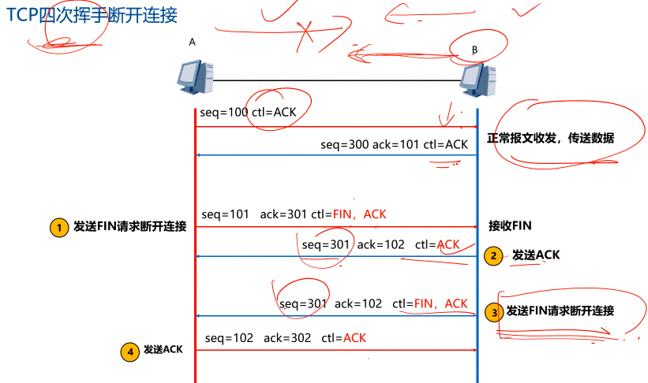

# 网络工程师学习笔记

## 前言：备考指南

### 1. 资源
 网盘资源：https://pan.baidu.com/s/193mRx0RHChP5aMlO4HOxXQ
 密码：0lwv

### 2. 学习内容


1. 计算机基础：看补充视频
2. 计算机英语
3. 教材内容

### 3. 学习时间规划

* 3月，看完基础精讲视频，基础97+华为17
* 4月，做3套真题找感觉，看真题29课时，2022.11～2023.11 偏难
* 5月，继续做题，冲刺

* 专题直播


## 第一章 计算机网络概论

### 1. 发展与分类

计算机网络的概念：
* 计算机网络 （ICT）： 计算机技术 IT + 通讯技术 CT
  * HCIA、HCIP  ICT工程师
* SDN ： Software Design Network
* 云计算

发展阶段：
 * 阶段一
 * 阶段二
 * 阶段三： 1977：ISO制订、1985:TCP/IP商用

计算机网络分类：

1. 通信子网 和 资源子网
  * 通信子网：通信节点、通信链路
  * 用户资源子网：PC、服务器
2. 网络拓扑结构
3. 按覆盖范围分类：局域网LAN、城域网MAN、广域网WAN
4. 按交换技术分类：电路交换网络、报文交换网络、分组交换网络
5. 按采用协议分类
6. 按传输介质分类
7. 按用途分类

### 2. OSI和TCP/IP模型

为什么进行分层？
* 早期系统封闭，更新慢
* 现在，NOW，兼容机，软硬分离、各司其职

OSI模型作用：
* 一层改变不影响其他层，有利于系统设计、开发和故障排查；
* 产业标准化
* 允许多个厂商共同开发
* 各个设备无缝融合
* 网络技术快速迭代，降低成本

OSI模型七层内容

TCP/IP参考模型

TCP/IP模型对应协议


### 3. 数据封装与解封的过程

* APDU：Application Protocol Data Unit （进程号）
* Segment （端口号）
* Package （IP）
* Frame （MAC）
* Bit 

## 第二章 数据通信基础

### 1. 信道特性

数据通信的概念：
* 信源
* 信道
* 信宿

信道带宽：
* 模拟信道带宽：W = f2-f1 Hz
* 数字信道带宽：bit/s

码元和码元速率：
* 码元：一个数字脉冲（时钟周期的信号）
* 码元速率（单位时间的数字脉冲）：Baud = 1/T（码元宽度）
* 一个码元携带信息量n = log2N（码元种类）

奈奎斯特定理：
* **最大**码元速率 B = 2W 
* 极限数据速率 R = B log2N = 2W log2N

香农定理：
* 极限（数据）速率 C = W log2（1+S/N）
* 分贝 dB = 10 lg S/N
* S/N：信噪比， dB = 30， S/N = 1000 ，C约等于10W

* QPSK：N=4、DPSK：N=2


> 辨析：数据传输速率和带宽之间有密切的关系，但它们并不是完全相同的概念。
> - **带宽（Bandwidth）**：带宽是指在一个特定时间内能通过某个通信信道的最大数据量。通常用Hz（赫兹）来表示，比如1 Hz表示每秒传输1个周期的信号。在网络通信中，带宽通常以比特率（bits per second，bps）来表示，例如兆比特每秒（Mbps）或千兆比特每秒（Gbps）。
>- **数据传输速率（Data Transfer Rate）**：数据传输速率是指在网络中实际传输数据的速度，通常也以比特率（bps）来表示。这是指在网络中实际传输数据的速度，通常也以比特率（bps）来表示。数据传输速率取决于带宽以及其他因素，如网络拥塞、信号干扰等。
带宽决定了数据传输的最大速率，但实际数据传输速率可能会受到其他因素的影响，如网络拥塞、信号干扰、传输协议效率等。因此，尽管带宽越高，理论上传输速率也越高，但实际数据传输速率可能受到其他因素的限制。
总的来说，带宽决定了网络的潜在传输能力，而数据传输速率则是实际数据在网络中传输的速度。


### 2. 信道延迟

> 计算
> 考试放到最后算
1. 公式
   * **信道（总）延迟 = 线路延迟 + 发送延迟 = 线路长度/传播速率 + 数据大小/数据传输速率**
   * 光纤信道传播速率：3e8 m/s
   * 电缆信道中传播速率： 2e8 m/s
   * 卫星信道传播时延： 270ms（单程）
2. 单位换算
   * 1 Byte = 8 bit
   * 100M 的线路带宽表示 100 Mbit/s = 100 000000 bit/s
   * 1000 Byte = 1000 x 8 bit

### 3. 传输介质

1. 有线：同轴电缆、双绞线、光纤

* 双绞线：多对绝缘铜导线两两相互缠绕，为了降低干扰
  * 100M 4根
  * 1000M 8根 （全用）
  * 规格：TIA/EIA定义： 5类、超5/6类、超6类、7类（10G、必须屏蔽线）
  * 网线：100m
  * 屏蔽线STP 与 非屏蔽线UTP：减小电磁干扰、辐射
* 光纤：玻璃或塑料纤维的全反射原理
  * 长距离传输
  * 光缆：多根光纤和塑料保护套管与塑料外皮构成
  * 分类：
    * 多模光纤：850、1300nm
    * 单模光纤：1310、1550nm
  * 光接口与光模块：用于光纤与交换机的互连；有单芯和双芯；
  * 光纤之间的连接：
    1. 熔接
    2. 使用连接器：
        * LC（小方口）：网络设备常用
        * SC（大方口）
        * ST（圆形）：配线架
        * FC（圆形螺纹）：配线架
  * 跳线与尾纤：
    1. 双绞线跳线：带有水晶头的网线
    2. 光纤跳线：带有连接器与保护层的光纤
    3. 尾纤：用于熔纤 

2. 无线：无线电波 500kHz～1000MHz、微波 300MHz～300GHz、红外线、激光

### 4. 数据编码

1. 曼彻斯特编码
2. 差分曼彻斯特编码：双相码、“**有0无1**”、波形从第二位开始看
3. 两种编码的特点：
   * 双相码，每一位要求电平变化
   * 具有**自定时和检测错误**功能
   * 能将时间和数据包含在信号数据流中，称为自同步码
   * 编码效率都是：**50%**
   * **数据速率是码元速率的一半**
4. 其他编码：
   * 4B/5B ：百兆 ，80%
   * 8B/10B ： 千兆 ， 80%
   * 64B/66B ： 万兆 ， 97%

### 5. 调制技术
> 针对模拟信号的技术

1. 幅度键控ASK ： 振幅表示0、1
2. 频移键控FSK ： 快慢不同
3. 相移键控PSK ； 形状不同
4. 正交幅度调制QAM ： 两个幅度相同、相位相差90度的模拟信号合并

* DPSK波形：看波形是否变化，**有0无1**
* PSK = BPSK = 2PSK

### 6. ‼️ 脉码调制PCM
> 针对基带传输（数字信号）
> 
1. 三个步骤：
  * 采样：
    奈奎斯特采样定理：以`≥2倍最高频率`进行采样，得到的离散信号能完整还原 
  * 量化：将采样的连续值转换为离散值
  * 编码:
2. PCM计算
  * 不使用奈奎斯特和香农公式
  * 计算题速率单位全换算成bit/s
  * Hz单位表示每秒多少次

### 7. 通信和交换方式

1. 按通信方向分：
   * 单工通信：电视、广播
   * 半双工通信：wifi、对讲机、Hub（集线器）
   *  全双工通信：电话、交换机
2. 按同步方式分：
   * 异步传输：HDLC，引入起止位，效率低
   * 同步传输：发送前 发送SYNC同步符，2个以上进入同步状态，多用于短距离高速传输

3. 数据交换方式
   * 电路交换：物理通路，独占
   * 报文交换：存储转发 ，数据不拆分，报文中有传输路径
   * 分组交换：进行分组，可分组纠错
     * 数据报：每个分组独自处理 IP
     * 虚电路：传送之前先建立逻辑连接 X.25、ATM、FR

### 8. 数字传输系统E1/T1

1. 多路复用技术
   * 多路复用器Multiplexer ： OLT
   * 多路分配器Demultiplexer ： ONU（光猫）
   1. 频分复用 ： 无线电广播、ADSL、FDD-LTE
   2. 时分复用： T1/E1 、 SONET/SDH 、 Wifi 、 TDD-LTE
   3. 波分复用：本质是频分复用，c = f ✖️ 𝝺
2. E1/T1
   1. E1速率：2.048、64k
   2. T1速率：1.544 
3. 同步数字虚列
   1. OC-3 、STM-1、155Mbps
   2. OC-12 622Mbps
   3. OC-48、2.5Gbps
   4. OC-192、10Gbps

### 8. 海明码纠错码

差错控制方法：纠错和检错

1. 奇偶校验：检错方法
> 在assic码的末尾加入1位，使整个码中的1的个数位奇数或偶数

2. 海明码：检错和纠错
   * 海明距离（码距）：两个码字的不同的位数
   * 原理：加入几个校验码，均匀拉大码距，当一位出错，其他位数也变化
   * ⭐️海明不等式：2^k - 1 ≥ m + k
   * ‼️ 海明码编码：校验位与数据位的关系（将数据位位数分解，分解的数值包含哪些，就决定了该校验位的数值）

### 9. CRC循环冗余校验码

* 只能检错 

计算步骤：
  1. 判断校验位位数，生成多项式最高次是几，位数就是几
  2. 补齐数据位后面的0
  3. 提取生成多项式的系数
  4. 用第二步的数据 除以 多项式系数，进行异或运算，余数为校验码


## 第三章 广域通信网

### 1. 广域网物理层特性

* 公共交换电话网络：PSTN
* 本地回路：
  * DTE数据终端设备：PC、电话机
  * DCE数据电路设备：猫/调制解调器/Modem
* 机械特性：
  * RS232-C接口：几何形状、引线数、尺寸
  * 25针D型： 老式打印机
  * 9针：串行接口、如交换机的console接口
  * USB + RS232 + **RJ45水晶头**
  * MGMT网络远程调节接口
* 电气特性：
  * RS-232-C采用V.28标准电路，20kb/s，15米

### 2. 流量与差错控制

* 流量控制：X.25 、TCP
  * 停等协议：发一个等一等
  * 滑动窗口协议：连续发送多个帧
* 差错控制：
  * ARQ自动重传协议：
    *  停等ARQ协议
    *  选择重发ARQ协议：只重发没收到的、SREJ
    *  后退N帧ARQ协议：重新从没收到的帧开始发、REJ
    *  公式：**选上退下**

### 3. 帧中继FR与HDLC

1. 帧中继FR
   * 第二层数据链路层协议，虚电路的分组方式；
   * 分组交换，面向连接的服务；
   * 只做检错和拥塞控制，没有流控和重传，开销小；
   * 帧长可变 2～45Mbps
   * 不保证可靠提交
2. ISDN和ATM
   * ISDN：
     * BRI：144kbps
     * PRI：2.048Mbps
   * 宽带ISDN即ATM：
     * 信元交换，53字节
     * 虚电路
     * 150M
3. ⭐️HDLC
   * 高级数据链路控制：High level Data Link Control
   * 面向位的同步链路控制协议
   * CRC-16、CRC-32校验，帧边界 `01111110`
   * 控制字段：8bit
     * 信息帧（I帧）：承载数据和控制
     * 监控帧（S帧）：差错控制和流量控制
       * RR：00
       * RNR：10
       * REJ：01
       * SREJ：11
     * 无编号帧（U帧）：链路建立控制，也可承载数据


## 第四章 局域网和城域网

### 1. 局域网基础


### 2. CSMA/CD
> 16次网络繁忙，不再尝试发送

> CSMA/CD（Carrier Sense Multiple Access with Collision Detection，载波监听多路访问与碰撞检测）是一种用于协调共享介质的网络访问方法，常用于以太网等局域网技术中。在CSMA/CD中，有三种不同的竞争方式，分别是非坚持型、1-坚持型和P-坚持型。它们之间的区别在于节点在检测到信道忙碌时采取的不同策略。

1. **非坚持型**：
   - 当节点要发送数据时，首先监听信道。如果信道空闲，节点立即发送数据。
   - 如果信道忙碌，则节点等待一个随机的时间间隔后再次监听信道。如果仍然忙碌，则继续等待随机时间间隔，直到信道空闲，然后发送数据。
   - 非坚持型避免了竞争节点同时发送数据的情况，但可能会导致节点在等待间隔过长时间后才能发送数据。

2. **1-坚持型**：
   - 当节点要发送数据时，首先监听信道。如果信道空闲，节点立即发送数据。
   - 如果信道忙碌，则节点持续监听信道直到信道空闲。一旦信道变为空闲，节点立即发送数据，而不等待任何随机时间间隔。
   - 1-坚持型能够更快地发送数据，但可能导致多个节点同时发送数据，引发碰撞。

3. **P-坚持型**：
   - P-坚持型是一种折衷方案，结合了非坚持型和1-坚持型的特点。
   - 当节点要发送数据时，首先监听信道。如果信道空闲，节点立即发送数据。
   - 如果信道忙碌，则节点等待一个随机的时间间隔后再次监听信道。如果信道仍然忙碌，节点将持续监听信道，直到信道空闲，然后立即发送数据。
   - P-坚持型在一定程度上避免了同时发送数据的情况，并且相比非坚持型，在等待时间间隔方面更加灵活。

总的来说，非坚持型、1-坚持型和P-坚持型是CSMA/CD中不同的竞争方式，它们各自有着不同的优缺点，可以根据网络的特点和需求选择合适的竞争方式。


* 冲突检测原理
  * **边发边听**的检测原理

### 3. 二进制指数退避算法

* 后一次退避的时间不一定比前一次长
* 使用随机函数，降低冲突概率
* 16次冲突，不再发送
* 简化公式：冲突n次后，再次冲突概论 1/2^n


### 4. 最小帧长计算

* Lmin = 2R x d/v
* 不冲突条件： 发送时间 ≥ 传送时间 + 确认时间

### 5. 以太网帧结构与物理层规范

1. 以太网帧结构
   * 前7+1字节用于时钟同步，不计入帧长
   * 数据MTU ： **46～1500**字节
   * **4**字节校验位
   *  最小**64**字节
   *  最长**1518**字节

2. 以太网报文的封装
   * **以太网报头 14byte - IP报头 20byte - TCP报头 20byte - 数据部分 -以太网报尾 4byte** 

3. 802.3以太网（10M）
   * 物理层规范命名： 传输速率Mbps  - 信号方式 - 最大传输距离或传输介质
4. 802.3u 百兆以太网
   * 🎋 需要记忆
5. 千兆以太网
   * 802.3z 和 802.3ab
   * 4对双绞线，100m
6. 万兆以太网
   * 802.3ae、10G、光纤/双绞线
   * 点到点线路，不共享带宽，没有冲突检测机制

### 6. ⭐️ 虚拟局域网VLAN
> 对交换局域网进行分段，形成逻辑网络
> 不同VLAN通信需要经过3层设备：路由器、交换机、防火墙等
> **冲突域和广播域：一个中继器和集线器是一个冲突域，一个VLAN为一个广播域，交换机的一个接口为一个冲突域。**

* 冲突域：连接在同一共享介质上的所有节点，共享宽带，竞争，一个节点发出，所有能收到
* 广播域：交换机的所有接口为一个广播域，路由器的每个接口是一个广播域

1. 交换机VLAN的划分
   * 静态划分：基于交换机端口
   * 动态划分：基于MAC地址、基于策略、基于网络层协议、基于网络层地址
2. VLAN划分配置
   * 静态划分：

      ```
      [huawei] vlan 10
      [huawei-vlan10] quit
      
      [设备] interface GigabitEthernet 0/0/1
      [设备-GigabitEthernet0/0/1] port link-type access
      [设备-GigabitEthernet0/0/1] port default vlan 10


      ```
    
    * 动态划分
      ```
      # 基于mac地址


      # 基于策略
      
      ```

3. vlan作用
   * 减小冲突域，提高利用效率；
   * 提高网络安全性；
   * 突破地理位置而根据管理功能来划分。
4. 802.1Q标签
   * 4字节
     * TPID 16bit
     * PRI 3bit
     * CFI 1bit
     * VID 12bit 
  > 最多可配置4094个vlan ，0被用于识别优先级，4095留用
  > vlan标签的添加与删除处理过程快，无延迟
  > vlan标记，透明

5. 交换机的端口类型
   * Access端口：只能传单个vlan数据，摄像头、PC
   * Trunk接口：多个vlan，交换机之间  
   * Hybrid接口：混合接口
   * QinQ接口：双层标签，城域网

### 7. 生成树协议STP

1. 生成树技术背景
   冗余设计会解决单点故障问题，但会产生二层环路问题，需要用STP来解决二层环路问题。
   * 广播风暴：**网络慢、所有指示灯高速闪烁、CPU占用率高、CLI卡顿（命令行）**
   * MAC地址表的震荡
   * STP能防止环路，并保证冗余性。


2. 网桥ID
   * 8字节：2字节优先级，默认**32768**，6字节mac地址
   * 优先级：越小越优先，4096倍数
3. 路径开销
   * STP选择链路的参考值
   * 带宽越大，路径开销越小
   * 华为默认802.1t
4. STP选举操作 （BPDU报文）
     1. 确定根桥Root Bridge ： 选优先级和MAC地址最小的网桥
     2. 确定其他网桥的根端口Root Port ： 非根桥的端口到根桥最近的端口
     3. 每个段指定一个端口Destinated Port ： 先指定桥，指定桥上 为指定端口
     4. 选出非指定端口Nodestinated Port
      * 一端是RP，另一段是DP；一端是DP，另一段是RP或非指定端口
      * 优先级先比较开销，之后交换机ID（网桥ID），交换机端口ID
5. 几种生成树协议
   * 802.1d STP ：慢，30～50s
   * 802.1w RSTP ： 6s 快速收敛
   * 802.1s MSTP ：负载均衡

### 8. 城域网基础

1. E-lan，IEEE802.1ad，QinQ技术
   * 双层标签 各4字节
2. IEEE802.1ah，PBB，MAC-in-MAC技术

## 第五章 无线通信网

### 1. 移动通信与5G

1. 移动通信制式
   * 中国移动
   * 中国联通
   * 中国电信
2. 5G应用场景及关键技术
  * 应用场景
      * 20Gbps 速率
      * 海量连接-物联网技术
      * 超低延时uRLLC
  * 5G关键技术
    * 超密集异构无线网络
    * 大规模输入输出（MIMO）
    * 毫米波通信
    * `软件定义网络`：SDN `控制和数据分离`
    * `网络功能虚拟化`： NFV 

### 2. WLAN的通信技术

1. 无线网的三种通信技术：红外线、扩频、窄带微波技术

2. WLAN使用扩展频谱技术：频率跳动扩频FHSS（蓝牙） 和 直接序列扩频DSSS（wifi）

### 3. ⭐️WLAN的频谱和信道
1. WLAN网络分类
   * 基础无线网络
   * AD-hoc网络
   * 分布式无线系统
2. ISM频谱
   开放给 工业、科学、医疗 使用


3. 不重叠信道
   * 2.4G频段：
     * 13个信道，3个不重叠信道（1，6，11）
     * 信道中心频率相差5M
   * 5G + 5.8G频段
     * 开放5个不重叠信道
4. 信道重用与AP部署
   * 蜂窝妆，避免同频干扰

5. ⚠️802.11技术标准对比
   

### 4. 802.11 MAC层

* MAC层： LLC， MAC

* PPP： NCP，LCP

1. 802.11访问控制机制
   * CSMA/CA分布式协调功能：共同竞争； （冲突避免技术）
   * RTS/CTS信道预约：要发送先打报告；
   * PCF点协调功能：AP集中轮询，无竞争。
   
> 隐藏节点和暴露节点

2. 三种帧间间隔：
   * IFS（分布式协调IFS），最长的，优先级最低，用于异步帧竞争访问的时延；
   * PIFS（点协调），中等长，优先级居中，PCF操作中使用；
   * SIFS（短IFS），最短，优先级最高，快速回应时用到ACK。

### 5. Ad Hoc网络

> 无线移动节点组成的`对等网`，每个节点**既是主机，也是路由器**。

* MANNET网络特点：
  * 拓扑结构变化，不能使用传统路由协议；
  * 带宽小，信号衰弱、噪声影响大；
  * 电源容量有限；
  * 易窃听、欺诈、拒绝服务等恶意攻击威胁。

### 6. ⭐️WLAN安全


1. SSID访问控制:隐藏SSID ,让不知道的人搜索不到。 
2. 物理地址过滤：在无线路由器设置MAC地址黑白名单。 
3. WEP认证和加密：`PSK预共享密钥认证`，RC4加密。
4. `WPA `( `802.11i草案`)
   * 认证：802.1X。
   * 加密：RC4 (増强)+TKIP (临时密钥完整协议，动态改变密钥)支持**完整性认证和防重放攻击**。 
5. `WPA2 ( 802.11i)`
   * 针对WPA优化，加密协议是由RC4变为`基于AES的CCMP`。


## 第六章 网络互联与互联网

### 6-1 网络互连设备

#### 6-1-1 网络互连设备总结

| 设备层次     | 设备名称               | 工作原理                      |
| ------------ | ---------------------- | ----------------------------- |
| 物理层       | 中继器、集线器         | 放大信号，延长距离            |
| 数据链路层   | `网桥`、`交换机`       | 基于**目的MAC地址**转发数据帧 |
| 网络层       | `路由器`、三层级交换机 | 基于IP地址转发数据包          |
| 四层以上设备 | 网关                   | 基于传输层、应用层            |


#### 6-1-2 中继器与集线器

* 网络演进历史
  * 距离限制 → 中继器
  * 终端增加 → 集线器HUB
  * HUB + 中继器 + HUB

* 工作原理：
  * 一个接口进入的数据，进行信号放大，从其他所有接口进行泛洪。

* 产生问题：
  * 产生环路，广播风暴，影响效率；
  * 数据扩散，影响网络安全。　


#### 6-1-3 网桥与交换机

> 平时所说的交换机以二层以太网交换机为主

1. 初始情况下，交换机**MAC地址表**是空的。

| MAC地址            | 接口 | VLAN |
| ------------------ | ---- | ---- |
| 6字节目的，6字节源 |      |      |

2. 发送数据帧进行寻址，构建MAC地址表；

3. 交换机收到数据帧，将**原MAC地址学习到MAC地址表**中，并与接受该帧的接口进行关联；

4. 交换机在MAC地址表中查询目的MAC地址，发现没有匹配项，除入站接口进行**泛洪**；

5. 目的MAC地址的终端收到数据帧进行回复，封装回复包，交换机收到之后进行学习，端口进行关联。

6. 根据回复包的**目的MAC地址进行转发**。


#### 6-1-4 路由器与三层交换机

> 路由器：实现跨网段/跨VLAN通信。
>
> 三层交换机：具有路由功能的交换机，交换模块+路由模块。


* 广播域被认为是第二层的概念，像Hub、交换机等这些物理层、数据链路层的设备连接的节点被认为是同一个广播域，交换机所有端口默认都在VLAN1 ；
* 路由器，三层交换机可以划分广播域，即可以连接不同的广播域。


#### ⭐️6-1-5 路由器跟三层交换机有什么区别？

1. 典型园区网拓扑结构

   * 路由器：出口层1～2台；

   * 交换机：核心层、汇聚层N台；

2. 园区网主要技术应用

   1. 出口层：NAT、OSPF、静态路由、PPPoE等
   2. 核心层：堆叠、OSPF、静态路由、ACL等
   3. 汇聚层：DHCP、堆叠、链路聚合、生成树STP、OSPF、静态路由等
   4. 接入层：VLAN、生成树、链路聚合、AAA等

3. 对比

   | 类别     | 路由器                                       | 三层交换机                                        |
   | -------- | -------------------------------------------- | ------------------------------------------------- |
   | 应用场景 | 网络出口、骨干网                             | 局域网、园区网、城域网                            |
   | 功能     | NAT、PPPOE、SDH                              | VLAN、ACL、STP、堆叠                              |
   | 性能     | 一般路由器低于交换机；骨干网核心路由器性能强 | 整体性能高                                        |
   | 成本     | 较高                                         | 低                                                |
   | 总体     | 多面手，多种协议                             | 专用，以太网交换机、FC交换机、ATM交换机、FR交换机 |

   

#### 6-1-6 多层交换机/网关设备


* 网关是连接网络中操作在OSI传输层之上的设备。

* 功能：

  * 连接不同协议的子网；
  * 对不兼容的高层协议进行转换；
  * 异构设备之间通信。

  | 网关类型 | 解释     |
  | -------- | -------- |
  | 协议网关 | 路由器   |
  | 应用网关 | 数据中心 |
  | 安全网关 | 防火墙   |

* 多层交换机/多业务交换机

  * 插板卡

* SDN可编程交换机

* 网络演进进程总结

  集线器 - 二层交换机 - 三层交换机 - 多业务交换机- SDN交换机


### 6-2 网络层协议IP和ICMP

#### 6-2-1 IP报文格式

* 版本号（4bit）：0100 、0110 ；
* 头部长（4bit）：IHL，最小5，最大15，单位4字节，即最小5x4 = 20 字节
* TOS字段（8bit）：区分优先级
* 总长度（16bit） 
* 标识（16bit）
* 生存期（TTL）(8bit)：设置一个数据包可经过的路由器上限，每经过路由器`-1`
* 协议（8bit）
  * 1（ICMP）
  * 17（UDP）
  * 6（TCP）
* 头部校验和（16bit）
* 源IP（32bit）
* 目的IP（32bit） 

* IP数据可变长度：最长 65535 - 20 = 65515字节


#### 6-2-2 IP分片计算

> IP报文最大65535字节，而以太网MTU位1500字节。

* 根据**去除报头长度**来计算每片总长度；
*  片偏移量Offset = 前面分片的**数据部分长度**/8 ；

* MF ： 之后是否还有分片


#### 6-2-3 IP分类与特殊地址❓

* A类：1.0.0.0 - 127.255.255.255 /8
* B类：128.0.0.0 - 191.255.255.255 /16
* C类：192.0.0.0 - 223.255.255.255 /24
* D类：组播地址
  * IPTV
  * RIPv2 、 OSPF更新
* E类：保留


* 特殊地址：

  * 0.0.0.0：主机端：DHCP发Discover报文

    ​		服务端：

    ​		路由：默认路由

  * 255.255.255.255 ：受限广播地址；
  * 169.254.0.0/16:DHCP失败分配到的地址；
  * 127.0.0.1/8 : 本地环回地址，用于测试协议栈；
  * REC1918私有地址
    * A类：10.0.0.0/8
    * B类：172.16.0.0/12
    * C类：192.168.0.0/16
  * 常见组播：
    * 224.0.0.5:所有的OSPF的路由器
    * 224.0.0.6:DR和BDR的组播接受地址；
    * 224.0.0.9:RIPv2组播更新地址；

  

#### 6-2-4 ARP与RARP协议

>  ARP：根据IP寻址MAC地址；
>
> RARP：根据MAC寻找IP地址。


* 为什么需要ARP？
  * 在封装数据帧时，不知道目的MAC地址，需要进行查找。

| IP address | MAC addresse | status |
| ---------- | ------------ | ------ |
|            |              |        |


1. ARP请求：

   1. 封装在以太网帧中：

      | ETH_II                | ARP报文                                                 | FCS  |
      | --------------------- | ------------------------------------------------------- | ---- |
      | 目的MAC：`全F`｜源MAC | 目的IP｜源IP｜目的MAC：`全零`｜源MAC｜操作类型：Request | 帧尾 |

   2. ARP报文中请求为**广播**，回复为**单播**；


2. ARP地址解析五步曲
   1. 查询ARP表 `arp -a`
   2. ARP的`request报文广播`去请求对应的MAC地址；
   3. 主机B收到请求，更新ARP表，
   4. 之后回应`Reply单播报文`；
   5. 主机A收到Reply报文后，更新ARP表。

3. 免费ARP可以用来检测IP冲突。

4. 代理ARP
   1. **同一个网段、不同物理网络上**的计算机之间通信

#### 6-2-5 ICMP协议

> Internet控制报文协议，协议号为1，封装在IP报文中，用来传递差错、控制、查询等信息，典型应用 ping/tracert 依赖 ICMP 报文。

1. ping:使用`echo request`和 `echo reply`报文
2. tracert ：显示经过的三层节点
   1. TTL=1 ，TTL = 2，…… 
   2. 出现 `*` 可能
      1. 超时
      2. NAT
      3. 防火墙


### 6-3 传输层封装协议TCP和UDP

#### 6-3-1 TCP和UDP的报文格式

1. 传输层TCP :vs:UDP

   | TCP                                    | UDP                          |
   | -------------------------------------- | ---------------------------- |
   | 面向连接（发送之前打招呼🙋）            | 面向无连接                   |
   | 可靠传输                               | 传输不可靠                   |
   | 流控及窗口机制                         | 尽力而为传输                 |
   | TCP应用：WEB浏览器，电子邮件，文件传输 | UDP应用：DNS，音视频，IP语音 |

2. TCP报文格式

   1. 源端口（16bit）：标识应用，最大端口号： 0～65535
   2. 目的端口（16bit）
   3. 序列号（32bit）
   4. 确认号（32bit）
   5. 偏移值（4bit）
   6. 保留（6bit）
   7. Flag位：URG紧急、PSH要求取走缓存、RST重置（未打开连接）、SYN、ACK、FIN（断开连接/不同意连接）
   8. 窗口（16bit）：流控
   9. 校验和（16bit）

   

   TCP报文固定头部 **20字节**，但可以扩展，最大扩展到60字节，与IP报文相同。

   

3. TCP伪首部

   本质上是IP头的一部分，包含 **源目IP地址，协议号，TCP报头**，主要用于TCP校验和计算。12字节。

4. UDP报文格式

   1. 源端口16bit
   2. 目的端口16bit
   3. 长度16bit
   4. 校验吗16bit
   5. 数据

   * 固定8字节

#### 6-3-2 TCP三次握手

1. 三次握手过程

   
   
   1. 发送 seq = 1  ctl： SYN
2. 回 seq=0 、 ack = 1  ctl：SYN、ACK
   3. 发送seq = 1 、ack = 1     ctl ：ACK


> * TCP flag位的ACK位都是1；
> * seq 为服务器给客户端的序号；
> * 随机数，ack序号=接收到的序号seq+1；
> * SYN包就是SYN标记设置为1的tcp包。

2. 四次挥手断开链接

   > 传输过程中的变化`ack = seq + 1`



#### 6-3-3 流量控制和拥塞控制

1. TCP流量控制
   1. 防止发送速度过快，接收方处理不过来，浪费资源
   2. 可变大小的**滑动窗口**
   3. `PUSH`，通知上层取走缓存，窗口快速置零。


2. TCP拥塞控制
   1. 流量控制：AB两个端点进行
   2. 拥塞控制：AB和所有网络节点中进行
      1. 使用**拥塞窗口cwnd**进行拥塞控制
      2. 慢开始阶段：指数增长，直到门限；
      3. 拥塞避免阶段：指数增长，直到发生超时； 
      4. **之后重新进入慢开始阶段，门限值变为拥塞值的一半**

####  6-3-4 重点协议的端口号总结

1.  TCP/UDP端口
   1. 源端口随机分配`>1024`
   2. 目的端口号为服务器端应用服务器的进程，`telnet：23`


###  6-4 路由协议

#### 6-4-1 IP路由基础

1. 什么是路由？

   1. 路由器或三层设备，收到数据包，会**查看目的IP地址**，并在路由表中进行查找，匹配到最优的路由后，将数据包扔给接口或下一跳。

2. 路由器工作原理

   1. 建立并维护路由表RIB
      1. 直连路由：路由器本地接口所在网段；
      2. 静态路由：手工配置的路由条目
      3. 动态路由：路由器之间通过动态路由协议RIP学习到的路由。
   2. 根据路由表进行数据转发

3. 查看路由表RIB

   ``````huawei
   display ip routing-table
   ``````

   | Destination/Mask | Protocal  | Pre  | Cost | Flags | NextHop | Interface |
   | ---------------- | --------- | ---- | ---- | ----- | ------- | --------- |
   |                  | Direct    | 0    |      | D     |         |           |
   |                  | OSPF      | 10   |      | R     |         |           |
   |                  | IS-IS     | 15   |      |       |         |           |
   |                  | STATIC    | 60   |      |       |         |           |
   |                  | RIP       | 100  |      |       |         |           |
   |                  | OSPF AS E | 150  |      |       |         |           |
   |                  | OSPF NSSA | 150  |      |       |         |           |
   |                  | IBGP      | 255  |      |       |         |           |
   |                  | EBGP      | 255  |      |       |         |           |


#### 6-4-2 静态路由和默认路由

1. 静态路由

   1. 计算是否同一网段，IP与掩码进行与运算
   2. 网关
   3. 静态路由的配置

   ``````Router
   ip route-static 网络号 掩码 下一跳IP地址  // 其中掩码有两种表示方法
   ``````


2. 默认路由

   1. 去往任何不知道的地址，都默认选择一个出口路由

   ```Router
   ip route-static 0.0.0.0 0 下一跳IP地址  // 其中掩码有两种表示方法
   ```

   

#### 6-4-3 动态路由协议RIP/OSPF/BGP/ISIS

1. 动态路由协议分类
   1. 距离矢量协议：路由表（不知道全网拓扑）
      1. RIP
      2. BGP 路径矢量
   2. 链路状态协议 ：**全网拓扑**，SPF算法
      1. OSPF 
      2. IS-IS
   3. IGP ：内部网关协议
      1. RIP
      2. OSPF
      3. ISIS
   4. EGP：外部网关协议
      1. BGP

2. RIP协议（Routing Information Protocol）
   1. `UDP 520` 端口

   2. `30s`更新，`180s`表示不存在，`300s`删除

   3. RIP v1 与 RIPv2 对比：

      | RIPv1                                                | RIPv2                 |
      | ---------------------------------------------------- | --------------------- |
      | 有类，不带子网掩码                                   | 无类，带子网掩码      |
      | 广播更新                                             | 组播更新              |
      | 周期`30s`                                            | 触发更新              |
      | 不支持`VLSM`（变长子网掩码）、`CIDR`（无类域间路由） | 支持`VLSM`、`CIDR`    |
      | 不提供认证                                           | 提供明文和 `md5` 认证 |

   4. RIP防环机制

   5. 最大跳数：自动`+1`，最大`16跳`，意味不可达；

   6. 水平分割

   7. 反向毒化的水平分割：`cost = 16`

   8. 抑制定时器

3. OSPF （Open Shortest Path First）开放式最短路径优先协议

   1. OSPF基础
      1. 内部网关协议，链路状态路由协议
      2. 最广泛的IGP
      3. 交互链路状态信息 接口-网段信息
      4. `SPF算法（Dijkstral）`，计算最短路径
      5. **支持VLSM**，**支持手工路由汇总，****不支持自动汇总**

   2. OSPF特点
      1. 适应范围广：支持各种规模网络
      2. 快速收敛，拓扑变化立刻更新报文
      3. 无自环，`SPF最短路径算法`进行计算，**无环路**
      4. 区域划分：允许区域管理，减小路由器和内存消耗，降低宽带占用
   3. OSPF Cost
      1. Cost = 100M（参考带宽）/接口带宽，<1 ：按1处理

   4. OSPF区域概念：所有非骨干网区域必须与骨干区域（`area 0`）**直连**
   5. OSPF路由器角色：
      1. Internal Router
      2. Area Border Router
      3. Backbone Router
      4. AS Boundary Router

   6. OSPF总结
      1. `Area 0 / Area 0.0.0.0` 表示骨干区域
      2. 点对点网络`10s`发送`hello报文`，NBMA网络`30s`一次，Deadtime为hello时间`4倍`
      3. 组播地址
         1. `224.0.0.1` - 本地子网所有主机
         2. `224.0.0.2` - 本地子网所有路由器
         3. `224.0.0.5` - 运行OSPF协议的路由器
         4. `224.0.0.6` - OSPF指定/备用指定路由器DR （指定路由器）/BDR（备份指定路由器）

4. BGP （Border Gateway Protocol）边界网关协议，属外部网关协议 EGP 的一种

   1. BGP基础

      1. 用于不同自治系统AS之间，寻找最佳路由
      2. `TCP 179` 建立连接。`支持VLSM和CIDR`，路径矢量协议BGP4，BGP4+ 支持IPV6

   2. BGP四个报文

      | 报文类型       | 功能                            | 备注（类比） |
      | -------------- | ------------------------------- | ------------ |
      | `Open`         | 建立邻居关系                    | 建立外交     |
      | `Update`       | 发送新的路由信息                | 更新外交信息 |
      | `Keepalive`    | 对Open的应答/周期性确定邻居关系 | 保持外交活动 |
      | `Notification` | 报告监测到的错误                | 发布外交通告 |

   3. BGP的选路规则

      1. 丢弃下一跳不可达路由
      2. 优选`Preference_Value`最高的路由（私有属性，本地有效）；
      3. 优选`Local_Preference` 最高的路由；
      4. 优选 `手动聚合` > `自动聚合` > `network` > `import` > 从对等体学到的；
      5. 优选 `AS_Path` 最短的路由
      6. 起源类型 `IGP` > `EGP` > `Incomplete`

5. ISIS （intermediate system to intermediate system,中间系统到中间系统）是内部网关协议，分级的链路状态路由协议

   1. `Hello报文`寻找邻居
   2. `SPF算法`
   3. 两层
      1. `L1` 普通区域：L1
      2. `L2` 骨干区域： L2 和 L1/L2，带L2的都是骨干区域


* Router-ID的选取规则：第一个设置的为主，手动为主


## 第七章 下一代互联网

### 1. IPv4问题与改进

1. 地址数量短缺，32位43亿个地址，IPV6为128位；
2. 网址分配不合理；
3. 路由速度慢，路由表越来越庞大，IPV4头部多达13个字段，IPV6只有8个字段；
4. 缺乏安全功能：IPV4没有加密、认证等机制，IPv6集成IPSec功能；
5. 不支持新业务模式：没有拓展字段，IPV6支持多报头嵌套；
6. IPV6只能由源发节点进行分段，中间路由器不能分段，简化路由处理，MTU发现


### 2. IPv6报文格式


1. 版本（4位）：0110；
2. 通信类型/流量等级（8位）：用于区分不同的IP分组，相当于IPv4中服务类型字段。
3. 流标签（20位）：标识特定分组；
4. 负载长度（16位）：固定头部40字节之外的负载长度，拓展报头包含在负载长度之中。
5. 下一头部（8位）：指明下一个头部类型，可能是**IPv6扩展头部或高层协议的头部**。
6. **跳数限制（8位）：用于检测路由循环，类似TTL；**
7. 源地址（128位）
8. 目标地址（128位）


* 拓展报头：

  | 下一头部编号 | 下一头部类型             | 解释     |
  | ------------ | ------------------------ | -------- |
  | 0            | Hop-by-Hop Option Header | 逐跳选项 |
  |              |                          |          |
  |              |                          |          |
  |              |                          |          |
  |              |                          |          |
  |              |                          |          |
  |              |                          |          |
  |              |                          |          |

  


